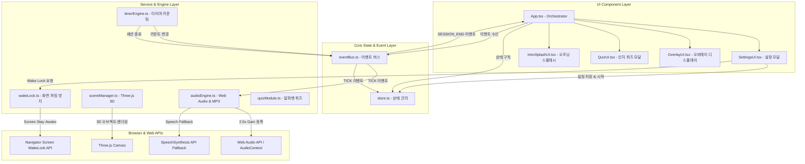

# 🏗️ System Architecture & Program Structure (시스템 구조도)

## Thinking Meditation 애플리케이션 아키텍처

---

## 1. 전체 아키텍처 개요 (High-Level Architecture)

Thinking Meditation은 단일 페이지 애플리케이션(SPA) 구조로, **View Layer (React)**, **Core State & Event Bus**, **Service Modules (Timer, Audio, 3D Canvas, WakeLock)** 로 명확히 분리되어 있습니다.



---

## 2. 디렉토리 및 모듈 구조도 (Directory & File Map)

```
/
├── index.html                  # 메인 HTML (OpenGraph / Meta 태그 / Favicon 설정)
├── metadata.json               # 앱 플랫폼 메타데이터 (Permissions & Capabilities)
├── PRD.md                      # 제품 요구사항 정의서
├── ARCHITECTURE.md             # 시스템 아키텍처 및 구조도 문서
├── README.md                   # 프로젝트 사용 설명서
├── public/
│   ├── og_thumbnail.svg        # OpenGraph 카카오톡/SNS 공유 썸네일 (1200x630)
│   ├── thumbnail.svg           # 파비콘 및 스퀘어 아이콘 (800x800)
│   ├── audio/                  # MP3 오디오 리소스
│   │   ├── male/               # InJoon 남성 오디오 (InJoon_1~100, A~Z)
│   │   └── female/             # SunHi 여성 오디오 (SunHi_1~100, A~Z)
│   └── three.js                # Three.js 번들 라이브러리
└── src/
    ├── App.tsx                 # 최상위 애플리케이션 진입점 및 모듈 오케스트레이터
    ├── main.tsx                # React DOM 렌더러 진입점
    ├── index.css               # Tailwind CSS 및 커스텀 애니메이션 (@keyframes popFade)
    ├── types.ts                # 전역 TypeScript 타입 및 인터페이스
    ├── components/             # React UI 컴포넌트
    │   ├── IntroSplashUI.tsx   # 시작 스플래시 화면
    │   ├── SettingsUI.tsx      # 명상 시간/간격/음성/3D배경 설정 화면
    │   ├── OverlayUI.tsx       # 3D 화면 위 숫자/알파벳 반투명 팝업 디스플레이
    │   └── QuizUI.tsx          # 명상 종료 후 알파벳 기억 테스트 퀴즈
    ├── core/                   # 핵심 상태 및 이벤트 시스템
    │   ├── store.ts            # 발행/구독 모델 기반 전역 중앙 스토어
    │   └── eventBus.ts          # Publish-Subscribe EventBus 패턴 구현
    └── modules/                # 비즈니스 로직 및 외부 연동 엔진
        ├── timerEngine.ts      # 정밀 인터벌 타이머 및 카운트 수열 생성기
        ├── audioEngine.ts      # Web Audio Gain 2.5x 오디오 증폭 & TTS Engine
        ├── sceneManager.ts     # Three.js 6종 3D 아쿠아/만다라 캔버스 관리자
        ├── wakeLock.ts         # Screen Wake Lock API & 1px Silent Video Fallback
        └── quizModule.ts       # 세션 도출 알파벳 기억 검증 로직
```

---

## 3. 주요 모듈 동작 메커니즘 (Key Module Mechanisms)

### 3.1. 타이머 & 수열 엔진 (`timerEngine.ts`)
1. **수열 생성 규칙**:
   - 명상 전체 시간과 선택한 간격(5초~15초)을 바탕으로 전체 Step 수를 계산.
   - 전체 Step 내에서 숫자는 역순으로 카운트다운 되며, 중간 중간 랜덤한 위치에 알파벳(A~Z)을 배치.
2. **이벤트 발행**:
   - 설정된 간격마다 `eventBus.emit('TICK', currentLabel)`을 호출하여 AudioEngine과 OverlayUI에 동시 전달.

### 3.2. 오디오 증폭 엔진 (`audioEngine.ts`)
1. **Web Audio Gain Node 증폭**:
   - 브라우저의 `AudioContext`와 `MediaElementAudioSourceNode`를 연결.
   - 숫자 카운트의 경우 `GainNode.gain.value = 2.5`로 설정하여 음량을 **2.5배 획기적으로 증폭**.
2. **Fallback 보장**:
   - MP3 오디오 미존재 또는 로딩 실패 시 즉시 `window.speechSynthesis` (TTS)로 딜레이 없이 전환.

### 3.3. 모바일 화면 꺼짐 방지 (`wakeLock.ts`)
1. **Primary**: `navigator.wakeLock.request('screen')`을 시도하여 OS 수준의 화면 잠금 방지.
2. **Fallback**: iOS Safari 등 WakeLock API 제한 환경을 위해, 백그라운드 1px 무음 MP4 비디오(`silentVideoEl.play()`)를 연동하여 모바일 브라우저의 휴면 모드 진입 방지.
3. **Visibility Handler**: 사용자가 다른 앱으로 전환했다가 돌아올 때(`visibilitychange`) WakeLock 자동 재활성화.

---

## 4. 데이터 및 이벤트 흐름 (Data & Event Flow)

```
[사용자 '명상 시작하기' 클릭]
       │
       ▼
1. requestWakeLock() 실행 (화면 꺼짐 방지 활성화)
2. loadScene(sceneId) 실행 (Three.js 3D 배경 로드)
3. startMeditation(duration, interval) 실행
       │
       ▼ (매 intervalSec 초마다)
4. eventBus.emit('TICK', label)
       ├──► OverlayUI: popFade 애니메이션 및 반투명 텍스트 표시
       └──► audioEngine: MP3 재생 + Web Audio 2.5x Gain 증폭
       │
       ▼ (명상 종료 시)
5. eventBus.emit('SESSION_END')
       ├──► releaseWakeLock() (화면 꺼짐 방지 해제)
       └──► QuizUI 모달 오픈 (알파벳 회상 테스트)
```
